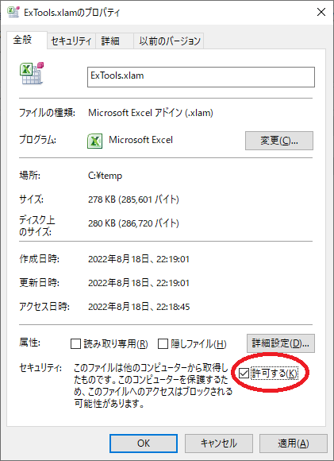

# エクセル拡張ツール インストール方法
以下の3つのファイルを任意のディレクトリに配置します。3つのファイルは同一ディレクトリに配置してください。
* ExTools.xlam
* ExTools_OptPack.xlam
* ExTools_OptPack.ini

## 【重要：マクロのブロックを解除】
2022年4月から、インターネット経由で入手された MS-OfficeファイルのVBAマクロがデフォルトでブロックされる仕様となりました。ダウンロード後の初回利用前には、以下の手順でブロックを解除してください。**この手順を実施しないとツールは起動できません。**

1. ファイル「ExTools.xlam」を右クリックしてプロパティを表示
1. 「全般」タブ下部の「セキュリティ」欄のチェックボックス（「許可する」）をチェック
1. 「OK」を押してプロパティを閉じる
1. ファイル「ExTools_OptPack.xlam」についても上記の操作を行う



以上の作業完了後、「ExTools.xlam」および「ExTools_OptPack.xlam」を直接開くことで実行できます。

<br>

# クイックアクセスツールバーの設定
クイックアクセスツールバーにシートの一覧メニューを追加することができます。設定手順は以下の通りです。


## カスタマイズ画面の表示
ExToolsを開いた状態（拡張タブが表示されている状態）でクイックアクセスツールバーの右端の矢印をクリックし、メニューから「その他のコマンド(M)」を選択します。
## 選択可能なマクロの一覧表示
表示されたダイアログにて、「コマンドの選択」コンボボックスから「マクロ」を選択します。選択可能なマクロが画面左側のリストボックスに表示されます。
> 一覧に表示されるマクロは環境により異なります。

## メニュー表示用マクロの選択
画面左側のリストボックスから「gsShowSheetOnMenu_2007」を選択し「追加(A)」ボタンを押します。画面右側のリストボックスに「gsShowSheetOnMenu_2007」が追加されることを確認します。この作業により、ブックに含まれるシートがクイックアクセスツールバーからメニュー形式で選択できるようになります。

## アイコンの変更
クイックアクセスツールバー上のアイコンを変更します。画面右側のリストボックスで「gsShowSheetOnMenu_2007」を選択し「変更(M)」ボタンを押します。
表示されたダイアログでお好みのアイコンを選択し、「OK」を押します。本資料ではサンプルとして蝶のマークを選択しています。


以上で作業は終了です。設定後のクイックアクセスツールバーに、選択したアイコンが追加されます。このアイコンをクリックすることでシートの一覧メニューが表示されます。

<br>

# アンインストール方法
## ファイルの削除
インストール先のフォルダから以下のファイルを削除してください。ファイル操作は以上です。
* ExTools.xlam
* ExTools_OptPack.xlam
* ExTools_OptPack.ini
> 本ツールは「ExTools_OptPack.ini」以外の設定ファイルやレジストリは一切使用しません。

## クイックアクセスツールバーの設定解除
インストール時の手順と同様にクイックアクセスツールバーのカスタマイズ画面を開きます。ダイアログにて「gsShowSheetOnMenu_2007」を選択し、画面中央の「削除(R)」ボタンを押します。完了後、「OK」を押します。


以上でアンインストールは完了です。

<br>

# 自動起動について
エクセルの自動起動ディレクトリ(XLStart)に配置することで、エクセル起動時に常に起動させることができます。自動起動ディレクトリの場所は環境により異なるため、MS社の情報などを参考にして下さい。

Microsoft Support : [アプリの開始方法 Excelカスタマイズする](https://support.microsoft.com/ja-jp/office/%E3%82%A2%E3%83%97%E3%83%AA%E3%81%AE%E9%96%8B%E5%A7%8B%E6%96%B9%E6%B3%95excel%E3%82%AB%E3%82%B9%E3%82%BF%E3%83%9E%E3%82%A4%E3%82%BA%E3%81%99%E3%82%8B-6509b9af-2cc8-4fb6-9ef5-cf5f1d292c19)

<br>

# DeepL社の認証キー設定
拡張パックの翻訳機能を使用するにはDeepL社へのアカウント登録、および登録後に提供される認証キーが必要です。毎月一定程度、無料枠（2022年現在、月500,000文字まで）で使用することができます。認証キーの取得については[DeepL社のホームページ](https://www.deepl.com/pro-api?cta=header-pro-api)でご確認ください。

各種ブログでも認証キーの取得方法が説明されています。併せて参照ください。
* [DeepL翻訳の無料APIキーを取得する手順](https://keikenchi.com/how-to-get-a-free-api-key-for-deepl-translator)
* [DeepL翻訳の無料版APIキーの登録発行手順！世界一のAI翻訳サービスをAPI利用](https://auto-worker.com/blog/?p=5030)

## 設定ファイルに認証キーを登録
認証キーを取得後、インストール先のフォルダにあるファイル「ExTools_OptPack.ini」をテキストエディタ（メモ帳など）で開きます。設定ファイルの「DEEPL_AUTH_KEY」の行に、取得した認証キーを貼り付けて保存します（以下の例の xxx～ 部分）。イコールの後に空白は不要です。
```
[TRANSLATE]
DEEPL_AUTH_KEY=xxxxxxxx-xxxx-xxxx-xxxx-xxxxxxxxxxxxxxx
DEEPL_LICENSE=FREE
```


## DEEPL社の有料版サービスを使用する場合
DEEPL社の有料版サービス（翻訳文字制限なし）を使う場合は、上述のファイルの「DEEPL_LICENSE」の行の値を「FREE」から「PRO」に変更してください。
```
DEEPL_LICENSE=PRO
```
以上で作業は完了です。
