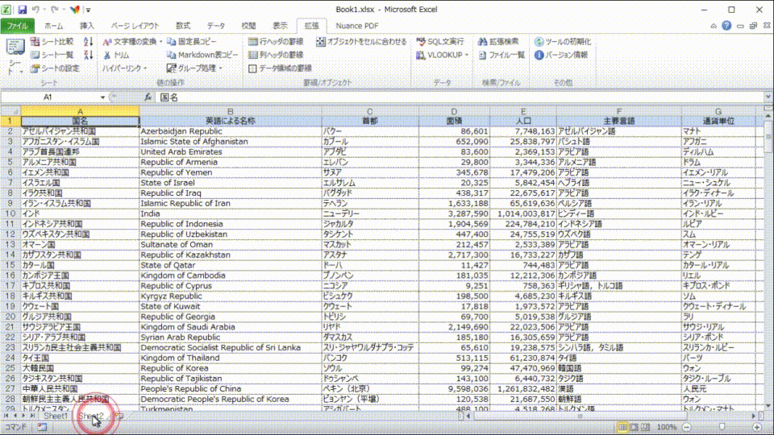
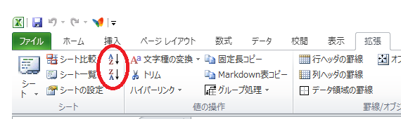
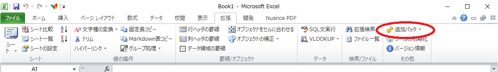

# エクセル拡張ツール 使用方法
ここでは「拡張」タブから使用可能な各機能の使用方法を説明します。

* [シートのメニュー表示](#anchor_sheetmenu)
* [シート/ブック比較](#anchor_compare)
* [シート一覧を出力](#anchor_list)
* [シートをソート](#anchor_sort)
* [シートの設定](#anchor_sheetformat)
* [文字種の変換](#anchor_conv)
* [値のトリム](#anchor_trim)
* [ハイパーリンク](#anchor_hlink)
* [固定長コピー／Markdown表コピー](#anchor_copy)
* [グループ処理](#anchor_group)
* [ヘッダ部の罫線を描画](#anchor_headerline)
* [データ部の罫線を描画](#anchor_data_line)
* [オブジェクトをセルに合わせる](#anchor_fitshape)
* [オブジェクトの補正](#anchor_AdjstShape)
* [SQL文実行](#anchor_SQL)
* [VLOOKUP](#anchor_VLOOKUP)
* [拡張検索](#anchor_search)
* [ファイル一覧出力](#anchor_filelist)
* [拡張ツールの初期化](#anchor_init)
* [バージョン情報](#anchor_version)

* [拡張パック](#anchor_optpack)
  * [電話番号にハイフンを付与](#anchor_phonenum)
  * [翻訳](#anchor_translate)

<br>

# シートのメニュー表示<a id="anchor_sheetmenu"></a>
アクティブなブックに含まれるシートをクイックアクセスツールバーまたは「拡張」タブの「シート」にメニュー表示します。メニューからシート名称を選択することで、各シートに移動します。シートの数が多い場合には、30シート毎にグループ化して表示されます。


<br />

# シート/ブック比較<a id="anchor_compare"></a>
アクティブなブックに含まれる２つのシート（比較元シート、比較先シート）、または２つのブックを比較し、差分を一覧出力します。差分一覧は同一のブックに出力することも、別のブックとして出力することも可能です。同一のブックに出力すると、各差分へのハイパーリンクが自動的に設定されます。また、比較先の差分箇所を赤くマークすることも可能です。



## 操作方法
比較元、比較先シートを選択後、オプションを設定し「比較実行」ボタンを押します。
「比較方法」は、各セルを比較する際の方式を選択します。

以下に例を一覧します。２番目の例では、セルの入力値が「2000年12月31日」で、セルの表示書式が異なる場合、「値」の比較では一致（○）とみなされますが、「テキスト」の比較では不一致（×）とみなされることを表します。「テキストまたは値」の比較では、値が合致しているため一致（○）とみなされます。
また、エラーを含むセルを「値」で比較する場合は、エラーの内容に関わらず、エラー同士は一致（○）とみなされます。以下の例では、”#VALUE!” と “#NAME?” は値の比較で同一と見なされています。エラーを「テキスト」で比較する場合は、表示文字列として比較されます。


| 比較元シート<br>入力値 | 比較元シート<br>表示(テキスト) | 比較先シート<br>入力値 | 比較先シート<br>表示(テキスト) | 比較結果<br>(テキスト) | 比較結果<br>(値) | 比較結果<br>(テキストまたは値) |
| -: | -: | -: | -: | :-: | :-: | :-: |
| 2000年12月10日 | 2000/12/10 | 2000年12月10日 | 2000/12/10 | ○ | ○ | ○ |
| 2000年12月31日 | 2000/12/31 | 2000年12月31日 | 12月31日 | × | ○ | ○ |
| 2000年12月10日 | 2000年12月 | 2000年12月15日 | 2000年12月 | ○ | × | ○ |
| 2000年12月10日 | 2000/12/10 | 2000年12月15日 | 2000/12/15 | × | × | × |
| 12.3456 | 12.3 | 12.3456 | 12.3 | ○ | ○ | ○ |
| 12.3456 | 12.3 | 12.3456 | 12.3456 | × | ○ | ○ |
| 12.34 | 12.3 | 12.3456 | 12.3 | ○ | × | ○ |
| 12.3333 | 12.3 | 12.3456 | 12 | × | × | × |
| ※計算エラー | #VALUE! | ※無効な関数 | #NAME? | × | ○ | ○ |


差分は「比較先」に指定されたシートまたはブックにマークされます。また、「比較元」に指定されたシートまたはブックには、行の差分が補正されます。

## 画面パラメータ
以下のパラメータを設定します。

| パラメータ | 説明 |
| - | - |
| 比較元シート | アクティブなブックに含まれるシートから、比較するシートを選択します。 |
| 比較先シート | アクティブなブックに含まれるシートから、比較するシートを選択します。「マーカー」で着色が設定された場合、このシートに着色されます。 |
| 比較元ブック | 比較するブック（ファイル）を選択します。 |
| 比較先ブック | 比較するブック（ファイル）を選択します。「マーカー」で着色が設定された場合、このブックに着色されます。 |
| 出力先 | 比較結果(差分一覧)の出力先を選択します。<br>以下のオプションから選択します。<br>　・別ブック<br>　・比較先ブックの末尾<br>「比較先ブックの末尾」を選択すると、差分一覧に各差分へのハイパーリンクが設定されます。 |
| マーカー | 比較の結果、抽出された差分箇所を赤色で着色します。<br>着色は「比較先」に設定されたシートに行います。<br>以下のオプションから選択します。<br>　・何もしない<br>　・文字を着色<br>　・セルを着色<br>　・枠を着色<br>マーカーを「何もしない」以外に設定すると、差異のあるセルについて、対応するセルの値がコメントに表示されます。 |
| 比較方法 | 値の比較の方法を指定します。<br>以下のオプションから選択します。<br>　・テキスト: 画面表示されている内容で比較<br>　・値: 入力されている内容で比較<br>　・テキストまたは値: 画面表示または入力されている内容で比較 |

## 制限事項等
バージョン 1.3 より行の追加・削除の差分検出が可能になりました（列の追加・削除差分検出には対応していません）。また、これに伴い、従来は「比較元」に選択されたシートは一切の変更が行われませんでしたが、「比較元」のシートまたはブックにも行の補正が行われる仕様に変更されました。使用に際してはあらかじめコピーしたファイルを使用するなどの対応をお願いします。

Excel本体にシート比較機能が実装されたことに伴い、本機能は将来のバージョンで削除する予定です。旧バージョンのExcelをお使いの方のために当面は削除しません。※ExToolsとして今後、本機能のメンテナンスは行いません。

<br />

# シート一覧を出力<a id="anchor_list"></a>
アクティブなブックに含まれるシートの一覧表を作成します。シート名のほか、各シートの先頭ｍ行、ｎ列のセル値を一覧表に含めることが可能です。行数および列数にゼロを指定することで、シート名称のみの出力も可能です。エクセル方眼紙の大量のシートからヘッダ部分を一括で抜き出し、目次を作る事などを想定した機能です。


## 操作方法
「出力先」を選択し、「行数」および「列数」を設定した後、「実行」ボタンを押します。
必要に応じて出力結果から不要な列を削除してください。

## 画面パラメータ
以下のパラメータを設定します。

| パラメータ | 説明 |
| - | - |
| 出力先 | シート一覧の出力先を選択します。<br>以下のオプションから選択します。<br>　・別ブック<br>　・同一ブックの先頭<br>　・同一ブックの末尾<br>同一ブックに出力する場合、出力結果の一覧シート自体も一覧に含まれます。 |
| 行数 | シート数と共に出力する行の範囲を指定します。<br>０～１０の整数を指定します。 |
| 列数 | シート数と共に出力する列の範囲を指定します。<br>０～６０の整数を指定します。 |
| ハイパーリンクの設定 | 出力結果のシート名に、各シートへのハイパーリンクを設定します。<br>「出力先」に”別ブック”を指定した場合には無効です。 |

<br>

# シートをソート<a id="anchor_sort"></a>
アクティブなブックに含まれるシートを名称でソートします。



## 【制限事項等】
ソートはシート名称を文字列として実行します。

<br>

# シートの設定<a id="anchor_sheetformat"></a>
シートの各種設定を一括設定します。処理単位はアクティブなシート、ブック全体、およびディレクトリに含まれるすべてのエクセルファイルが選択可能です。


## 操作方法
「実行対象」と、実施する処理を選択した後、「実行」ボタンを押します。
「すべて選択」「選択解除」ボタンを押すことで、チェックボックスおよびラジオボタンの一括選択/一括解除ができます。

## 画面パラメータ
以下のパラメータを設定します。

| パラメータ | 説明 |
| - | - |
| 実行対象 | 対象となるシートを選択します。<br>　・現在のシート： 現在のシートのみを対象<br>　・ブック全体： 現在のブックに含まれるすべてのシートを対象<br>　・ディレクトリ単位： 選択したディレクトリに含まれるブック |
| スクロールを初期化 | 「ウィンドウ枠の固定」および「分割」を解除し、セル「A1」が表示されるように表示位置を設定します。 |
| フォント色を初期化 | すべてのセルの文字色を標準（黒）に設定します。 |
| ハイパーリンクを削除 | すべてのハイパーリンクを削除します。<br>※セルの文字列は残ります。 |
| コメントを削除 | すべてのコメントを削除します。 |
| ヘッダとフッタの表示設定 | ヘッダおよびフッタにページ数、シート名、印刷日時などを設定します。 |
| マージンを設定 | 印刷マージンを設定します。 |
| 改ページと印刷範囲をクリア | すべての改ページ設定および印刷範囲設定を削除します。 |
| ズームを100%に初期化 | シートの表示倍率を100%に設定します。 |
| 印刷の拡大/縮小 | 「ページ設定」メニュー-「ページ」タブ-「拡大縮小印刷」の設定と同一です。 |
| ビューを標準に設定 | シートの表示を「改ページプレビュー」または「標準」に設定します。 |
| オートフィルタ | オートフィルタの設定を選択します。<br>　・フィルタ解除： オートフィルタを解除<br>　・全て表示： オートフィルタ設定は残したまま、全行を表示<br>　・１行目でフィルタ： １行目にオートフィルタを設定 |

## 制限事項等
「ヘッダとフッタの表示設定」「マージンを設定」における設定は、ソースコード内の定数を編集することで変更可能です。詳細は「その他の事項」の「定数の編集」を参照してください。デフォルトではマージンをExcelの余白設定の「狭い」の設定に合わせています。

ディレクトリ単位での一括設定を行う場合には、ファイルの読み取り専用属性が解除されていることを確認してから実行してください。

<br>

# 文字種の変換<a id="anchor_conv"></a>
選択範囲の文字列について、変換を行います。選択可能な変換方式は以下の通りです。

| 機能 | 説明 |
| - | - |
| 大文字 | すべてのアルファベットを大文字に変換 |
| 小文字 | すべてのアルファベットを小文字に変換 |
| 単語の先頭文字を大文字 | 各単語の先頭文字を大文字、２文字目以降を小文字に変換 |
| 全角 | すべてのアルファベット、数値、カタカナを全角に変換 |
| 半角 | すべてのアルファベット、数値、カタカナ、ひらがなを半角に変換<br>※ひらがなは半角カタカナに変換されます。 |


## 制限事項等
「単語の先頭文字を大文字」では、VBA関数の仕様上、２バイト文字とアルファベットが空白なしで記述されている場合、１単語として認識されます。以下に変換の例を示します。
*	「私のdog」  → 「私のdog」 （単語の先頭は”私”であるため、”dog”は変換されない）
*	「私の dog」 → 「私の Dog」 （”dog”の先頭が変換される）

「文字種の変換」および｢値のトリム｣は、数式の設定されたセルを処理対象外と見なします。この仕様はV1.1.1.0より実装されました。以前のバージョンでは数式が値で上書きされていました。動作が変更されたため、使用に際しては留意願います。

日本語以外の言語（中国語等）で「単語の先頭を大文字」「全角」「半角」を実行すると、文字化けを起こします。

<br>

# 値のトリム<a id="anchor_trim"></a>
選択範囲のセルの値をトリム処理します。文字列両端の全角、半角スペースが取り除かれます。

## 制限事項等
「文字種の変換」の制限事項欄を参照してください。
 
<br>

# ハイパーリンク<a id="anchor_hlink"></a>
選択範囲の各セルの文字列を元に、セル毎にハイパーリンクを設定します。また、ハイパーリンクの解除も可能です。

エクセル標準のハイパーリンク操作機能では、文字のフォントとサイズがシステム標準のフォントに変更されてしまいますが、本機能では、設定/解除ともに、処理前の文字フォント、および文字サイズは変更されません。アンダーバーのみ残る使用となっています（リンクを削除する場合でもアンダーバーは残ります）。
## 制限事項等
本機能はセルに記述されたURL、ファイルまたはフォルダ名称が有効であるかのチェックは行いません。

<br>

# 固定長コピー／Markdown表コピー<a id="anchor_copy"></a>
選択範囲の値をテキスト形式でクリップボードにコピーします。


上図の例で「固定長コピー」を選択すると、以下のテキストがクリップボードに格納されます。各列の幅は、セルに設定された文字列の長さから自動的に設定されます。数値と日付けは左揃えで出力されます。セル内の文字列が８０バイト以上の場合は当該セルの設定内容が切り捨てられます。

```
---------- ---------- -------- ---------- ----------
部門コード 社員コード 社員名称 職種       マネージャ
        10          1 山田太郎 社長                 
        10          2 鈴木次郎 マネージャ          1
        20          3 吉田三郎 マネージャ          1
        20          4 久本史郎                      
        30          5 木村五郎 マネージャ          1
---------- ---------- -------- ---------- ----------
```

同様に上図の例で「Markdown表コピー」を選択すると以下のテキストがクリップボードに格納されます。選択範囲の1行目はヘッダと見なされます。また、1行目の各セルの文字揃えに応じて各列の文字揃え（左、右、中央）が自動的に設定されます。セル内の文字列に改行が含まれる場合は```<br>```に変換されます

```
| 部門コード | 社員コード | 社員名称 | 職種 | マネージャ |
| -: | -: | - | - | -: |
| 10 | 1 | 山田太郎 | 社長 |  |
| 10 | 2 | 鈴木次郎 | マネージャ | 1 |
| 20 | 3 | 吉田三郎 | マネージャ | 1 |
| 20 | 4 | 久本史郎 |  |  |
| 30 | 5 | 木村五郎 | マネージャ | 1 |
```

<br>

# グループ処理<a id="anchor_group"></a>
選択範囲の値に対して、以下の処理を行います。

| 機能 | 説明 |
| - | - |
| グループ化（列） | 選択範囲のセルの入力に応じてグループを横方向に自動設定します。 |
| グループ化（行） | 選択範囲のセルの入力に応じてグループを縦方向に自動設定します。 |
| 重複データのカウント | 選択範囲のセルに含まれる値の重複を集約・カウントします。 |
| 重複値を階層表示 | 選択範囲のセルに含まれる値の重複を帳票のタイトル列（階層）と見立て、重複セルの値を削除します。 |

## 操作方法
### グループ化（行）
任意の選択範囲の１列目をグループと見なし、行のグループを設定します。なお、選択範囲は任意ですが、最初の１列目のみがグループ化の対象となります。


### グループ化（列）
上述の「グループ化（行）」と同等の処理を列に対して行います。

### 重複値のカウント
選択範囲の値の重複をカウントし、結果を別ブックに出力します。重複は行単位で判定されます。以下の例では、A列とB列の組み合わせを単位として、重複をカウントします。値が不連続でも問題なくカウントされます。


### 重複値を階層表示
選択範囲を表の横軸と見立て、連続した重複データを適宜削除します。以下の例ではA列～C列を選択して実行しています。
処理可能な範囲は８列までです。また、必ずしもＡ列から選択する必要はありません。


<br>

# ヘッダ部の罫線を描画<a id="anchor_headerline"></a>
選択範囲を帳票のヘッダとして罫線を描画します。描画するヘッダは表の上部（横軸）、および表の左側（縦軸）がサポートされています。


<br>

# データ部の罫線を描画<a id="anchor_data_line"></a>
選択範囲を帳票のデータ部分として罫線を描画します。※例は前述の「ヘッダ部の罫線を描画」を参照

<br>

# オブジェクトをセルに合わせる<a id="anchor_fitshape"></a>
選択したシェイプを、セルに沿って移動／リサイズします。以下の例では、長方形のシェイプを選択して「実行」ボタンを押すことで、シェイプが各セルの四隅に2ptのマージンでフィットするよう、サイズと位置を補正します。複数のシェイプを一括して設定することができます。


## 操作方法
対象となるシェイプを選択した後に画面を開き、マージンを設定して「実行」ボタンを押します。デフォルトでは上下左右全てを対象としてセルに合うよう、サイズと位置が自動調整されます。「詳細設定」をチェックして上下および左右を個別に設定することもできます。

## 画面パラメータ
以下のパラメータを設定します。

| パラメータ | 説明 |
| - | - |
| マージン | セルの端から各シェイプまでのマージン（隙間）をポイント単位で設定します。 |
| 詳細設定 | チェックすることで、以下の上下および左右の個別設定が可能になります。 |
| 上下幅の設定 | シェイプの上下のサイズ補正方法を設定します。以下のオプションから選択します。<br>　　・セルにフィット<br>　　・上端揃え<br>　　・下端揃え<br>　　・なにもしない |
| 左右幅の設定 | シェイプの上下のサイズ補正方法を設定します。以下のオプションから選択します。<br>　　・セルにフィット<br>　　・左端揃え<br>　　・右端揃え<br>　　・なにもしない |

## 制限事項等
「直線」シェイプは無視されます。将来のバージョンで、水平または直角に補正する機能を実装する予定です。

<br>

# オブジェクトの補正<a id="anchor_AdjstShape"></a>
選択したシェイプの微調整を行います。対象となるシェイプを2つ以上選択してください（1つだけ選択した状態では実行できません）。補正対象以外のシェイプは選択しても無視されます。

シェイプはPowerPointおよびその他のMS-Office製品と互換があるため、PowerPoint で作成したシェイプをExcelにコピー&ペーストし、本機能で補正したのちにPowerPointに改めてコピー&ペーストして戻すこともできます。

| 機能 | 説明 |
| - | - |
| ブロック矢印の矢じりを揃える | ブロック矢印の先端部分の幅を、最も短いものに揃えます。補正の対象となるのは「ホームベース」と「山形」のみです。 |
| 四角形の角丸みを揃える | 角丸四角形の丸みを、最も小さい丸みに揃えます。補正の対象となるのは「角丸四角形」のみです。 |
| 鍵コネクタの曲がり位置を揃える | 鍵コネクタの折れ曲がり位置を、もっとも頂上オブジェクトに近い位置のものに揃えます。補正の対象となるのは「カギ線コネクタ」と「曲線コネクタ」およびこれらに矢印が合わさったシェイプのみです。 |


<br>

# SQL文実行<a id="anchor_SQL"></a>
入力されたSQL文を実行します。SELECT文の場合は検索結果を新規シートに出力します。


## 操作方法
「ログイン」ボタンを押すとログインダイアログが開きます。ログインダイアログで「ログイン」ボタンを押して現在開いている保存済みExcelファイルにログインします。接続先にODBCを選択するとODBC経由でのDB接続も可能です。

「実行」ボタンを押すと、「SQLスクリプト」欄のSQL文が実行されます。バージョン2から、SELECT文に加えてDML（INSERT、UPDATE）の実行も可能になりました。

> ログイン先でエクセルが選択された場合には、現在開いているエクセルブックが対象となります。各シートの名称が「表」、第一列が「列の名称」と見なされます。表と列（シートと第一列目）の構成は、ログインしたタイミングで当該ファイルに保存されている内容を対象として実行されます。**バージョン2.2から、検索の実行時に自動保存する仕様変更されました。利用に際しては留意ください。**

エクセルからデータを検索する際には、FROM句でシートを ```[シート名$]``` 形式で指定します。

「サンプルSQLを挿入」ボタンを押すと、現在のワークシートの内容をもとにサンプルのSELECT文が「SQLスクリプト」欄に表示されるので参考にしてください。

以下の例では、シート「emp」と「dept」を結合し、DEPT表をマスタとして集計します。
```
SELECT b."DEPTNO",
       b."DNAME",
       SUM(IIF(ISNULL( a."COMM"), 0, a."COMM")+a."SAL") AS TOTAL_INCOME
  FROM [emp$] a INNER JOIN [dept$] b
    ON a."DEPTNO" = b."DEPTNO"
 GROUP BY 
       a."DEPTNO",
       b."DNAME"
HAVING TOTAL_INCOME > 9000
 ORDER BY a."DEPTNO"

```
以下の例では、シート「dept」表のLOC列を更新します。
```
UPDATE [dept$]
   SET loc = loc + ' / USA'
 WHERE deptno between '10' and '40'
```

## 画面パラメータ
以下のパラメータを設定します。

| パラメータ | 説明 |
| - | - |
| 日付書式 | 日付項目の書式を選択します。 |
| ヘッダ出力 | ヘッダ出力を設定します。以下のオプションから選択します。<br>　・列名称のみ<br>　・列名称と定義<br>　・ヘッダ無し |
| SQLスクリプト | 実行すSQL文を記述します。 |

## 制限事項等
DML文は自動的にコミットされます。ロールバックはできません。これはADOの仕様です。

データソースをエクセルとした場合には、DML文はINSERTとUPDATEのみが実行可能です。DELETE文は実行できません。これはエクセルの仕様です。

数値項目の検索において、検索結果の値がエクセルの許容する桁数（15桁）を超えるケースでは、出力結果は不正になります。

ADOが対応していないデータ型のカラムを取得しようとした場合にはエラーが発生します。本事象への対応は予定されていません。

データソースをエクセルとした場合にはカラム名（各シートの1行目）に含まれる改行はアンダースコア（_）に変換されて扱われます。そのほか、数字のみのカラム名や、ピリオド（.）を使用するとエラーになるなどの制約があります。SQLの構文、使用できる関数はRDBMSまたはExcelによって異なります。詳細については個別製品のマニュアルを参照ください。


<br>

# VLOOKUP<a id="anchor_VLOOKUP"></a>
VLOOKUP関数の設定をマウス操作で行えます。


VLOOKUP関数の定義は以下の通りです。
```
=VLOOKUP(ルックアップ値、ルックアップ値を含む範囲、戻り値の列番号、[検索方法])
```

## 操作説明
### 1. マスタ部分の指定
最初に、VLOOKUPのマスタ表部分となる範囲を選択し、「マスタ表領域を選択」を押します。この選択範囲がパラメータの「ルックアップ値を含む範囲」に相当します。また、選択範囲の一番左の列が主キー列となり、右の列がパラメータの「戻り値の列番号」に相当します。上図の例では選択範囲のC列（商品番号）がマスタ表の主キー列となります。最初の例ではC3～D6を選択することでD列（商品名）が「戻り値の列」に指定されます。2回目の例ではC3～E6を選択することでE列（単価）が「戻り値の列」に指定されます。

### 2. VLOOKUP関数として貼付け
次に、ルックアップ値が記載されている場所とVLOOKUP関数を設定したい場所を選択します。この際、最初にマウスドラッグを始めたセルの列がパラメータの「ルックアップ値」に相当します。また、選択を終えた列が実際にVLOOKUP関数を設定する列になります。上図の最初の例ではC列をルックアップ列とし、D列をVLOOKUP関数の出力先として選択します。この状態で、「VLOOKUPとしてペースト」を押します。

VLOOKUPの出力先を選択する際に、逆方向にドラッグすることでルックアップ列の左側に出力することもできます。上図の3回目（最後）の例ではC列からB列にドラッグして選択することで、B列にVLOOKUP関数が出力されます。

## 制限事項等
VLOOKUP関数の最後の引数（近似一致または完全一致を指定する「検索方法」）はFALSE（完全一致）で固定です。

<br>

# 拡張検索<a id="anchor_search"></a>
正規表現による検索ができます。セルの値や数式の他、テキストボックスやコメントの文字列も検索可能です。


※上記の検索例では、「WindowsXP」と「WindowsVista」が検索結果としてヒットします。正規表現の詳細については一般の資料を参照下さい。

## 操作説明
「検索する文字列」を入力し、「検索する対象」と出力方法を設定します。その他のオプションを設定した後、「実行」ボタンを押します。

## 画面パラメータ
以下のパラメータを設定します。

| パラメータ | 説明 |
| - | - |
| 検索する文字列 | 検索文字列を正規表現で入力します。 |
| 検索する対象 | 検索する範囲を設定します。以下のオプションから設定します。<br>　・現在のシート<br>　・ブック全体<br>　・ファイル |
| 出力方法 | 検索にヒットしたセルを着色する場合に設定します。<br>以下のオプションから設定します。<br>　・何もしない<br>　・文字を着色<br>　・セルを着色<br>　・枠を着色 |
| 検索するフォルダ | ファイル単位での検索を行う場合は、検索するフォルダを指定します。 |
| サブフォルダも検索 | ファイル単位での検索を行う場合は、サブフォルダも順次検索するかを指定します。 |
| 大文字小文字を区別しない | 検索時、大文字と小文字を区別しない場合に設定します。 |
| 検索対象 | シェイプやコメント、リンク先などの内容を検索する場合に指定します。以下のオプションから、必要なものをチェックします。<br>　・セルの文字列を検索（通常の動作です）<br>　・セルの数式を検索（セル内の関数など、式を検索します）<br>　・シェイプを検索<br>　・コメントを検索<br>　・セル名称を検索<br>　・シート名を検索<br>　・ハイパーリンク先を検索<br>　・ヘッダ・フッタを検索<br>　・グラフを検索<br>上記のオプションは「全て選択」および「選択解除」ボタンで一括設定することが可能です。 |

<br>

# ファイル一覧出力<a id="anchor_filelist"></a>
指定されたフォルダ以下のファイル一覧を作成します。出力対象（または除外対象）となるファイルのフィルタリング、ハイパーリンクの設定などが可能です。


## 操作方法
画面右上の「参照」ボタンを押し、一覧を作成するフォルダを選択します。そのほかのオプションを設定した後、「実行」ボタンを押します。
「閉じる」ボタンを押すと本画面は閉じます。

## 画面パラメータ
以下のパラメータを設定します。

| パラメータ | 説明 |
| - | - |
| 出力ルート | 出力の基準となるフォルダを入力します。「参照」ボタンを押してフォルダを選択することも可能です。 |
| 最大深度 | フォルダ階層が複雑な場合、最大深度を設定することで出力を制限できます。ゼロを選択すると、指定したフォルダの直下のファイルおよびフォルダだけを出力します。デフォルトは「無制限」です。 |
| 対象ファイル | フィルタを設定します。以下のオプションから選択します。<br>　・全てのファイル<br>　・以下の拡張子のみ<br>　・以下の拡張子を除外 |
| 拡張子 | 「対象ファイル」で拡張子によるフィルタリングを指定した場合に、拡張子を指定します。複数の拡張子を指定する場合はセミコロン（”;”）で区切ります。<br>  例） xml;html;log |
| サイズ単位 | 出力されるファイルサイズの単位を選択します。 |
| 相対パスで出力 | 「出力ルート」以下のフォルダについて、相対パスで出力する場合に指定します。 |
| ハイパーリンクの設定 | 各フォルダ、ファイルにハイパーリンクを設定する場合に指定します。 |
 
<br>

# 拡張ツールの初期化<a id="anchor_init"></a>
本ツールの内部設定を初期化します。本ツールの障害で動作が不安定になった場合に本メニューを実行してください。
> 本機能は現行バージョンでは無効です。将来のバージョンで対応予定です。

<br>

# バージョン情報<a id="anchor_version"></a>
本ツールのバージョンを表示します。

<br>

# 追加パック<a id="anchor_optpack"></a>
追加パックは、汎用的ではないも機能を提供する入れ物として、本体の ExTools.xlam とは分離したアドインファイル ExTools_OptPack.xlam として提供されています。ExTools_OptPack.xlam を起動すると「その他」グループの先頭に「追加パック」ボタンが現れます。
> ExTools_OptPack.xlam 単体でも使用できます。



追加パックは以下の機能を提供します。


* [電話番号にハイフンを付与](#anchor_phonenum)
* [翻訳](#anchor_translate)

<br>

# 電話番号にハイフンを付与<a id="anchor_phonenum"></a>
電話番号を表す文字列に対して、市外局番に応じたハイフンを付与します。
本ツールでは総務省の[市外局番の一覧（令和4年3月1日現在）](https://www.soumu.go.jp/main_sosiki/joho_tsusin/top/tel_number/shigai_list.html)で提供されている市外局番の他、携帯電話番号（090、080、070、060）およびIP電話（050）に対応しています。


## 制限事項等
電話番号はゼロから始まる文字列です。このため、セルのデータタイプが「文字列」に設定されているか、または文字列の先頭にアポストロフィが付与されている必要があります。
数値以外の文字（ピリオドやハイフン、括弧など）はすべて除外され、すべて半角ハイフンに統一されます。

上述以外の電話番号体系（フリーダイヤルや国番号を含む記述など）には対応していません。文字列の先頭を市外局番と認識できない場合は当該セルは無視されます（そのセルの値は変更されません）。

<br>

# 翻訳<a id="anchor_translate"></a>
DeepL社の翻訳機能を利用して、日→英、英→日の翻訳を行います。


## 操作方法
「翻訳言語」と「出力形式」を選択した後、「実行」ボタンを押します。

## 画面パラメータ
以下のパラメータを設定します。

| パラメータ | 説明 |
| - | - |
| 翻訳言語 | 翻訳する言語を選択します。DeepLでは多くの言語の組み合わせをサポートしていますが、本ツールでは日英のみを選択可能としています。<br>　・英語→日本語<br>　・日本語→英語 |
| 出力形式| 翻訳後の文章をどのように出力するかを設定します。以下の出力方法から選択します。<br>　・原文の下に追加<br>　・原文の上に追加<br>　・原文を削除して上書き<br>　・右のセルに上書き<br>　・コメントに上書き |

## 制限事項等
本機能を使用するためには、DeepL社のアカウント登録およびアカウント登録後に提供される認証キーが必要です。認証キーの取得については[エクセル拡張ツール インストール方法](installation.md)を参照ください。

本機能は翻訳対象となる文章をDeepL社に随時送信し、翻訳結果を受信します。このためオフラインでの使用はできません。認証キーが正しく設定されていない場合や通信エラーが生じた場合にはセルにエラーが出力されます。
